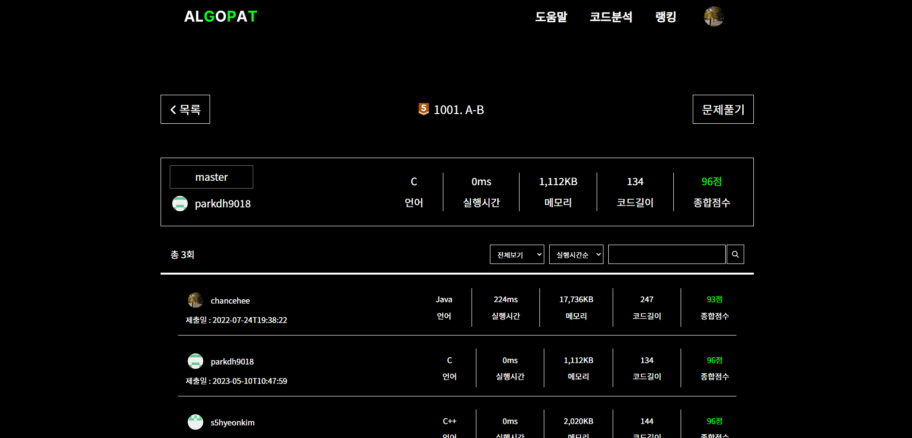
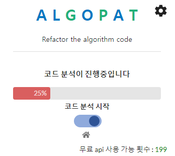
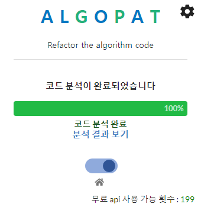
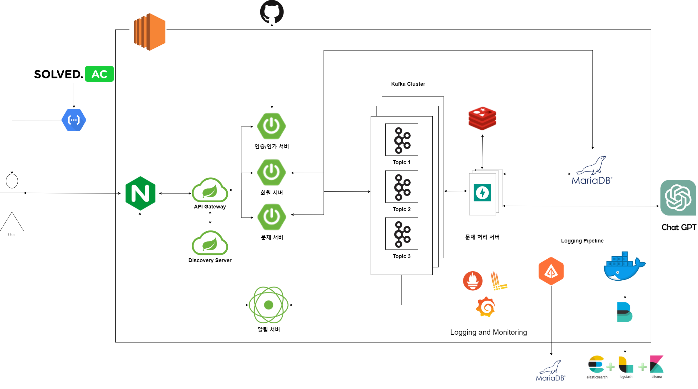
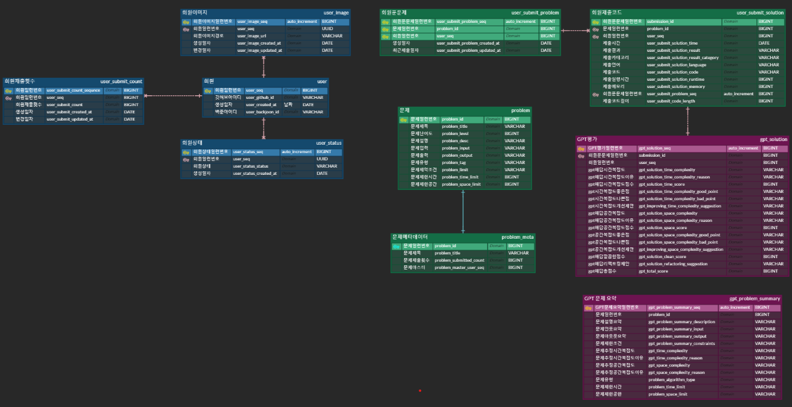
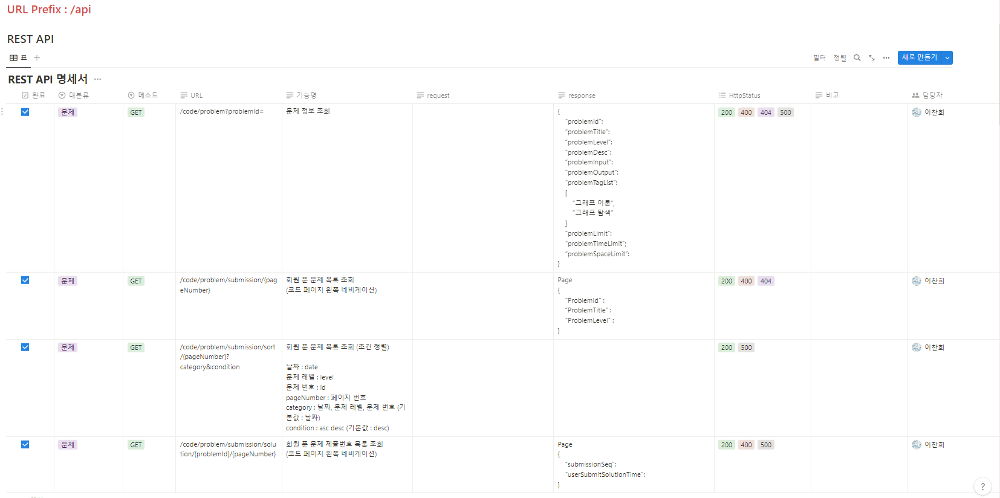
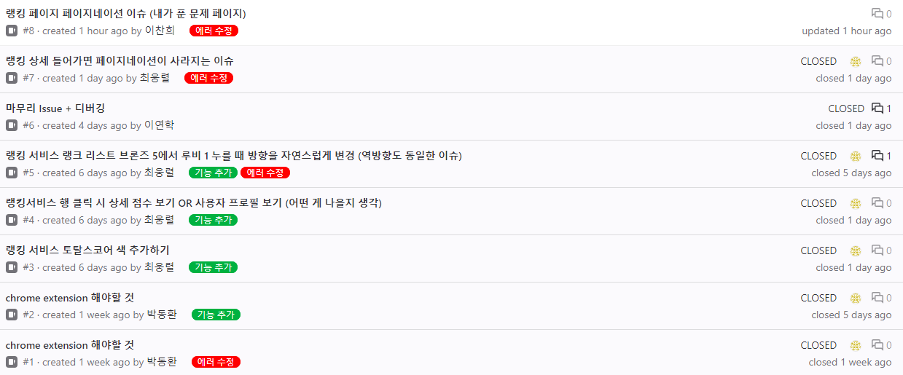

  

Algopat은 AI기반 알고리즘 소스코드 피드백 서비스입니다. 시간 및 공간 복잡도와 리팩토링에 대한 피드백을 제공해줍니다.

<!-- ## ✨ 프로젝트 주요 기술 

1. 인증/인가
   - Spring Cloud Gateway, Eureka를 이용한 Client-side Discovery pattern 구현
   - 각 서비스의 호출을 위해 JWT 이용
   - Spring Security 
   - OAuth 2.0  
2. 크롬 익스텐션
   - Crawling (문제, 회원 제출 코드)
   - WebFlux를 이용한 SSE (실시간 알림, 진행상황에 대한 progress bar UI 제공)  
3. 알고리즘 소스 코드 분석 
   - LangChain + ChatGPT 라이브러리를 활용한 코드 분석 
        - 시간 복잡도 (Big O)
        - 공간 복잡도 (Big O)
        - 리팩토링 가이드 
    - 사용자 경험 개선을 위한 무료 OPEN AI API KEY 체험 횟수 10회 제공
    - 비용 절감 및 응답 시간 최적화를 위한 캐싱 적용 (문제 정보)
    - DB 동시성 문제를 해결하기 위한 Redis를 이용한 분산락 구현 
    - Kafka를 통한 로드밸런싱으로 분산 환경에서 시스템 안정성 향상 
4. 랭킹 
   - 3가지 기준을 통한 순위 제공 (총 점수, 시간 복잡도, 제출 시간 기준으로 순위 집계)  
   - 내가 푼 문제 통계 기록 열람 가능 
5. 마이페이지 
   - 잔디 (제출 일자에 따른 활동 기록, 총 제출 횟수에 따른 비례식 적용)
6. Anomaly (SAGA Pattern : Choreography)
   - 비정상적인 예외현상 발생 시, 보상 트랜잭션 적용 (무료 제출 횟수 +1)
   - Kafka 전송 실패를 고려한 Retry 설정 적용 (50번, 10ms) 
7. MSA 구조에서 원활한 디버깅을 위한 Logging 및 Monitoring 환경 구축
    - Zipkin을 이용한 마이크로서비스 환경에서의 추적 시스템 구축 및 시각화
    - 각 서비스에서 발생하는 로그 메세지를 손쉽게 확인할 수 있는 환경 구축 및 시각화
        - FileBeats를 통해 도커 컨테이너의 필요한 로그 선별
        - 선별된 로그 Logstash를 통해 파싱한 후 Elasticsearch에 저장
        - 저장된 로그 데이터를 Kibana에서 시각화를 통해 더 쉽게 로그를 확인할 수 있는 환경을 구축했습니다. -->

## 🛠️ 기술 스택

 

 

 

 

 

 

   

 <b> 상세 기술스택 및 버전</b> 

| 구분     | 기술스택        | 상세내용           | 버전      |
| -------- | --------------- | ------------------ | --------- |
| 공통     | 형상관리        | Gitlab              | \-        |
|          | 이슈관리        | Jira                | \-        |
|          | 커뮤니케이션    | Mattermost, Notion | \-        |
| BackEnd  |                 | JPA                |      |
|          | Java            | Zulu               |  |
|          |                 | Spring Boot        | 2.7.11     |
|          | IDE             | IntelliJ           | 2022.3.1  |
|          | Build           | Gradle             |        |
|          | API Docs        | Postman            |           |
| FrontEnd | HTML5           |                    | \-        |
|          | CSS3            |                    | \-        |
|          | JavaScript(ES6) |                    | \-        |
|          | React           | React              | 18.2.0    |
|          | Node.js         | npm                | 18.14.2   |
|          | IDE             | Visual Studio Code | 1.78.2    |
| Server   | 서버            | AWS EC2            | \-        |
|          | 플랫폼          | Ubuntu\AWS Liunx   | 20.04 , AWS Linux2|
|          | CI/CD           | Docker             | 20.10.17  |
|          |                 | Jenkins            | jenkins/jenkins:lts|
|DATA      | DB              | MariaDB            | 10    |  
|          |                 |Elasticsearch       |7.17.9|
|          |                 |Kibana       |7.17.9|
|          |                 |Logstash       |7.17.9|
|          |                 |Filebeat       |7.17.9|
|          |                 |Kafka         |3.4|
|          |                 |Redis|7.0.7|

## 📋 상세 페이지  

### 메인 페이지  
  
### 코드 분석 결과 페이지  
  
### 랭킹 페이지  
  
### 랭킹 상세 페이지  
  
### 마이페이지  
 
### 분석 결과 알림 (Chrome Extension)
   

## 👪 개발 멤버 소개

<table>
    <tr>
        <td height="140px" align="center"> 
                😶 김소현  (Front-End) </a>  </td>
        <td height="140px" align="center"> 
                🙂 박동환  (Front-End) </a>  </td>
        <td height="140px" align="center"> 
                😆 이연학  (Front-End) </a>  </td>
        <td height="140px" align="center"> 
                👑 이찬희  (Back-End) </a>  </td>
        <td height="140px" align="center"> 
                😠ì´ì•ˆì±„  (Back-End) </a>  </td>
		<td height="140px" align="center"> 
                😶 최웅렬  (Back-End) </a>  </td>
    </tr>
    <tr>
        <td align="center">React Chrome Extension </td>
        <td align="center">React Chrome Extension </td>
        <td align="center">React Chrome Extension </td>
        <td align="center">Spring Boot Fast API </td>
        <td align="center">Spring Boot Fast API </td>
        <td align="center">Spring Boot Fast API CI/CD </td>
    </tr>
</table>

---

### 📋 시스템 아키텍처

---

<!-- ### 📋 ERD 다이어그램

--- -->

### 📆 프로젝트 기간 (23.04.10 ~ 23.05.19)

- 기획 및 설계 : 23.04.10 ~ 23.04.16
- 프로젝트 구현 : 23.04.17 ~ 23.05.14
- 버그 수정 및 산출물 정리 : 23.05.15 ~ 23.05.19

<!-- ## 👥 협업 관리  

<table>
    <tr>
        <td  align="center">
                노션  
        </td>
        <td align="center">
                지라  
        </td>
        <td align="center">
                깃랩 이슈  
        </td>
    </tr>
</table> -->
